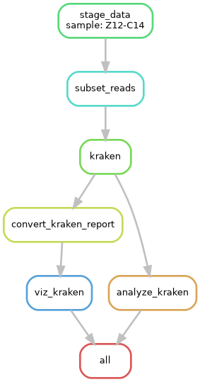

# Kraken Taxonomic Annotation Pipeline with Krona Visualization

## Overview

This Snakemake workflow performs taxonomic annotation of paired-end reads using Kraken, followed by visualization of the results with Krona. Additionally, a rarefaction step is applied before analysis, using the `subset_frac` parameter to subsample reads.

This workflow is designed for SLURM-based HPC clusters and supports configuration via two separate files:

1. `config.yaml` - Workflow parameters (samples, paths, and subset fraction).
2. `profile/slurm/config.yaml` - SLURM cluster settings


## Running the Workflow

1. Make sure Conda and Snakemake is available

2. Edit the `config.yaml` file: adjust sample names, file paths, and parameters.

3. Submit the Snakemake workflow using the SLURM profile:

```bash
snakemake --profile profile/slurm
```


## Expected Outputs

The workflow generates the following results:

| File                                        | Description                                         |
| ------------------------------------------- | --------------------------------------------------- |
| `results/{sample}_kraken_krona_report.html` | Krona visualization of Kraken taxonomic annotations |
| `data/{sample}_1.fastq.gz`                  | Subsampled (rarefied) forward reads                 |
| `data/{sample}_2.fastq.gz`                  | Subsampled (rarefied) reverse reads                 |
| `results/{sample}_kraken_report.tsv`        | Kraken raw classification report                   |
| `results/{sample}_kraken_report_converted.tsv`        | Kraken classification report converted for use with Krona                   |
| `results/{sample}_kraken_summary.txt`        | Summary statistics of Kraken report                   |


## Credits & License

- Author: Alexander Pfundner
- License: GPL
- Kraken: Developed by Wood & Salzberg (2019)
- Krona: Developed by Ondov et al. (2011)
- Seqtk: Developed by Heng Li (2013)
